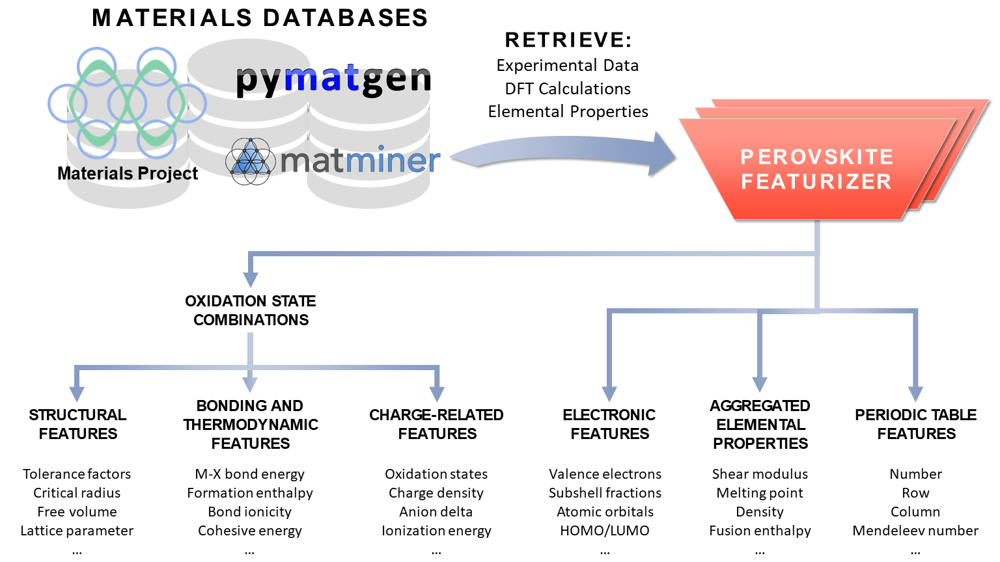
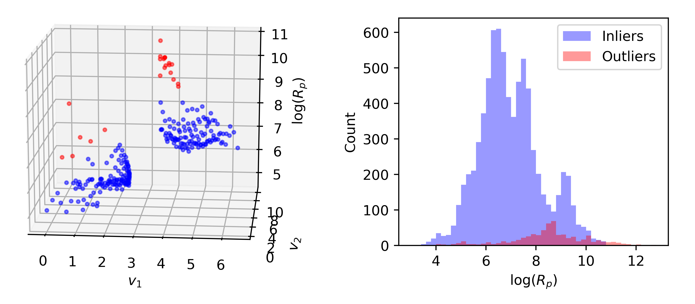

# Data mining for inorganic perovskites
This project seeks to develop open-source tools for physically meaningful data mining from inorganic perovskite data. This is a work in progress - please submit a pull request if you would like to contribute.

## Perovskite descriptor library

A library of physicochemical descriptors tailored to perovskites is implemented in a matminer-style featurizer. This is in the early stages of development. Current features include:
* Integrates data from matminer, pymatgen, and the Materials Project
* Descriptors related to bonding, structure, defects, and electrons calculated for individual sites and for the full composition
* Allows multiple cation substitutions at A and B sites
* Accounts for all possible oxidation states (and resulting combinations thereof) of multivalent cations

## Outlier detection for materials data

An outlier detection method for materials data, which accounts for materials clustering, is available. This employs the DBSCAN clustering algorithm in combination with Isolation Forest for robust detection of anomalous property values.
